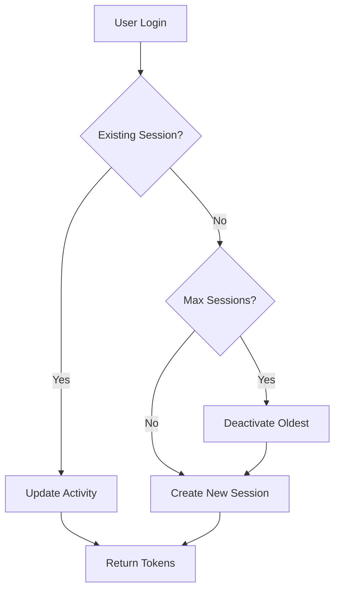
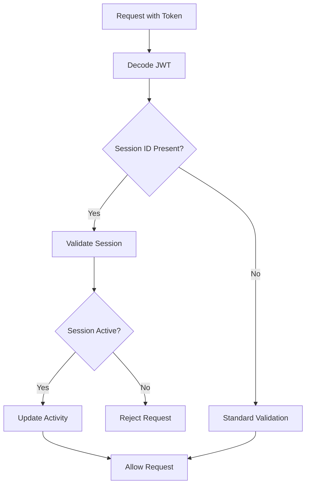

# Session Management System

## Overview

The Auth Service now includes a comprehensive session management system that tracks user sessions across different devices, prevents multiple concurrent logins, and provides security features like session timeout and device fingerprinting.

## Features

### 🔐 **Session Tracking**
- **Device Fingerprinting**: Tracks device information (browser, OS, IP address)
- **Session ID**: Unique identifier for each session
- **Activity Tracking**: Last activity timestamp for each session
- **Location Tracking**: Optional location information (country, city, timezone)

### 🚫 **Concurrent Session Control**
- **Maximum Sessions**: Configurable limit on concurrent sessions per user (default: 3)
- **Session Replacement**: Automatically deactivates oldest session when limit exceeded
- **Device Recognition**: Recognizes same device and maintains existing session

### ⏰ **Session Lifecycle**
- **Session Expiry**: Sessions expire after 7 days by default
- **Activity Timeout**: Sessions timeout after 30 minutes of inactivity
- **Automatic Cleanup**: Expired sessions are cleaned up automatically

### 🛡️ **Security Features**
- **Session Validation**: Every request validates session status
- **Token Binding**: JWT tokens are bound to specific sessions
- **Device Verification**: Prevents session hijacking across devices

## API Endpoints

### Session Management

#### Get Active Sessions
```http
GET /api/v1/auth/sessions
Authorization: Bearer <access_token>
```

**Response:**
```json
{
  "success": true,
  "statusCode": 200,
  "message": "Active sessions retrieved successfully",
  "data": {
    "sessions": [
      {
        "sessionId": "abc123...",
        "deviceInfo": {
          "userAgent": "Mozilla/5.0...",
          "ipAddress": "192.168.1.1",
          "deviceType": "desktop",
          "browser": "Chrome",
          "os": "Windows"
        },
        "location": {
          "country": "US",
          "city": "New York",
          "timezone": "America/New_York"
        },
        "isActive": true,
        "lastActivity": "2024-01-15T10:30:00Z",
        "createdAt": "2024-01-15T09:00:00Z",
        "expiresAt": "2024-01-22T09:00:00Z"
      }
    ]
  }
}
```

#### Deactivate Specific Session
```http
DELETE /api/v1/auth/sessions/{sessionId}
Authorization: Bearer <access_token>
```

#### Deactivate All Sessions
```http
DELETE /api/v1/auth/sessions
Authorization: Bearer <access_token>
```

#### Get Session Statistics (Admin)
```http
GET /api/v1/auth/sessions/stats
Authorization: Bearer <access_token>
```

## Configuration

### Environment Variables

Add these to your `.env` file:

```env
# Session Management
MAX_CONCURRENT_SESSIONS=3
SESSION_TIMEOUT_MS=1800000
SESSION_CLEANUP_INTERVAL=3600000
```

### User Model Configuration

```javascript
// Per-user session limits
maxConcurrentSessions: {
  type: Number,
  default: 3
},
sessionTimeout: {
  type: Number,
  default: 30 * 60 * 1000 // 30 minutes
}
```

## How It Works

### 1. **Login Process**


### 2. **Session Validation**


### 3. **Device Recognition**
- **User Agent Analysis**: Parses browser, OS, and device type
- **IP Address Tracking**: Monitors location changes
- **Fingerprint Matching**: Combines multiple factors for device identification

## Security Considerations

### ✅ **Implemented Security Measures**
- **Session Binding**: Tokens are bound to specific sessions
- **Device Verification**: Prevents cross-device session hijacking
- **Automatic Timeout**: Sessions expire after inactivity
- **Concurrent Control**: Limits number of active sessions
- **Secure Cleanup**: Expired sessions are automatically removed

### 🔒 **Best Practices**
- **HTTPS Only**: Always use HTTPS in production
- **Secure Headers**: Implement proper security headers
- **Rate Limiting**: Apply rate limiting to session endpoints
- **Monitoring**: Monitor for suspicious session activity
- **Logging**: Log session events for security analysis

## Usage Examples

### Frontend Integration

```javascript
// Login with session management
const login = async (email, password) => {
  const response = await fetch('/api/v1/auth/login', {
    method: 'POST',
    headers: {
      'Content-Type': 'application/json',
    },
    body: JSON.stringify({ email, password })
  });
  
  const data = await response.json();
  
  if (data.success) {
    // Store tokens
    localStorage.setItem('accessToken', data.data.accessToken);
    localStorage.setItem('refreshToken', data.data.refreshToken);
    
    // Check if existing session
    if (data.data.session.isExistingSession) {
      console.log('Logged in with existing session');
    } else {
      console.log('New session created');
    }
  }
};

// Get active sessions
const getSessions = async () => {
  const response = await fetch('/api/v1/auth/sessions', {
    headers: {
      'Authorization': `Bearer ${localStorage.getItem('accessToken')}`
    }
  });
  
  return response.json();
};

// Deactivate specific session
const deactivateSession = async (sessionId) => {
  const response = await fetch(`/api/v1/auth/sessions/${sessionId}`, {
    method: 'DELETE',
    headers: {
      'Authorization': `Bearer ${localStorage.getItem('accessToken')}`
    }
  });
  
  return response.json();
};
```

### Backend Integration

```javascript
// Check session in middleware
const checkSession = async (req, res, next) => {
  const token = req.headers.authorization?.substring(7);
  
  if (token) {
    try {
      const decoded = jwt.verify(token, process.env.JWT_SECRET);
      
      if (decoded.sessionId) {
        const isValid = await sessionService.validateSession(decoded.id, decoded.sessionId);
        if (!isValid) {
          return res.status(401).json({ message: 'Session expired' });
        }
      }
      
      req.userId = decoded.id;
      req.sessionId = decoded.sessionId;
    } catch (error) {
      return res.status(401).json({ message: 'Invalid token' });
    }
  }
  
  next();
};
```

## Monitoring and Maintenance

### Session Cleanup Job
- **Frequency**: Runs every hour
- **Purpose**: Removes expired sessions
- **Logging**: Logs cleanup statistics

### Health Checks
- **Session Count**: Monitor active session count
- **Cleanup Status**: Check cleanup job status
- **Performance**: Monitor session validation performance

### Alerts
- **High Session Count**: Alert when session count is unusually high
- **Cleanup Failures**: Alert when cleanup job fails
- **Suspicious Activity**: Alert on unusual session patterns

## Troubleshooting

### Common Issues

1. **Session Not Found**
   - Check if session was deactivated
   - Verify session ID is correct
   - Check if session expired

2. **Multiple Sessions Not Working**
   - Verify maxConcurrentSessions setting
   - Check device fingerprinting logic
   - Ensure proper session cleanup

3. **Session Timeout Issues**
   - Check sessionTimeout configuration
   - Verify lastActivity updates
   - Check system clock synchronization

### Debug Mode

Enable debug logging for session management:

```javascript
// In your .env file
DEBUG_SESSIONS=true
LOG_LEVEL=debug
```

## Performance Considerations

- **Session Storage**: Sessions are stored in MongoDB with proper indexing
- **Memory Usage**: Sessions are cleaned up automatically
- **Database Load**: Minimal impact with proper indexing
- **Scalability**: Designed to handle high concurrent users

## Future Enhancements

- **Session Analytics**: Detailed session analytics and reporting
- **Geolocation**: Enhanced location tracking and analysis
- **Risk Scoring**: Session risk assessment based on behavior
- **Mobile App Support**: Enhanced mobile session management
- **SSO Integration**: Single sign-on across multiple services
